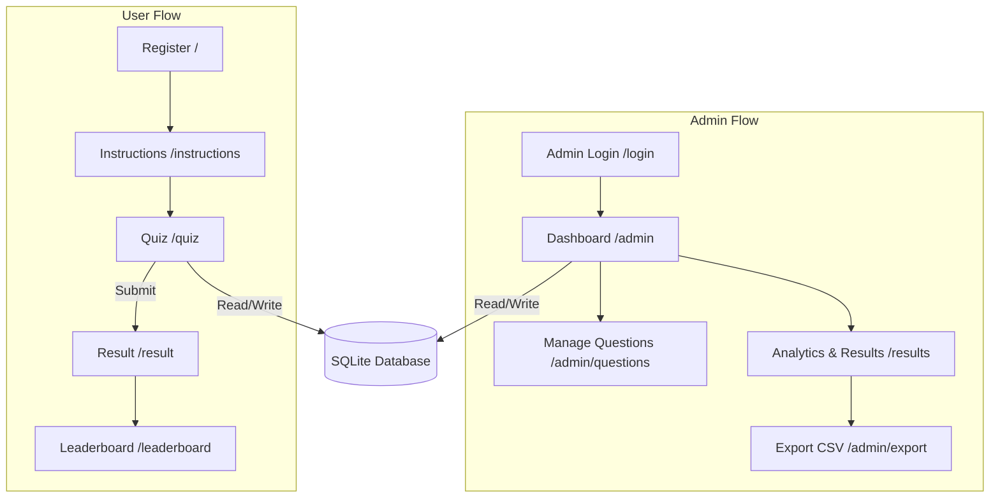

# Quiz Platform 🧠


A fully-featured, modern web-based Quiz Platform built with Python (Flask) and styled using Tailwind CSS. It supports user registration, timed quizzes, real-time results, leaderboards, and a comprehensive admin dashboard for managing questions and exporting results.

## Key Features

### 🎓 For Students
- **Registration**: Quick enrollment before starting the exam.
- **Timed Quiz Interface**: Interactive quiz layout featuring a countdown timer and a question palette for easy navigation.
- **Instant Results**: Immediate feedback on score, percentage, and pass/fail status.
- **Leaderboard**: Global ranking of the top 10 highest-scoring candidates.

### 🔐 For Administrators
- **Secure Login**: Protected admin routes using session management.
- **Manage Questions**: Full CRUD (Create, Read, Update, Delete) functionality for quiz questions and answers.
- **Analytics Dashboard**: Overview of total attempts, pass/fail ratios, and average scores.
- **CSV Export**: One-click download of all candidate results into a `.csv` file.

## Architecture & Flow



## Setup & Installation

1. **Clone the repository:**
   ```bash
   git clone https://github.com/swymwrld/Quiz-Platform.git
   cd Quiz-Platform
   ```

2. **Install dependencies:**
   Make sure you have Python installed.
   ```bash
   pip install -r requirements.txt
   ```

3. **Run the Application:**
   ```bash
   python app.py
   ```
   The app will automatically create the `database.db` file and run on `http://127.0.0.1:5000`.

## Default Admin Credentials
- **Username**: `admin`
- **Password**: `1234`
*(Remember to change these in `app.py` for production environments!)*

## License
MIT License
